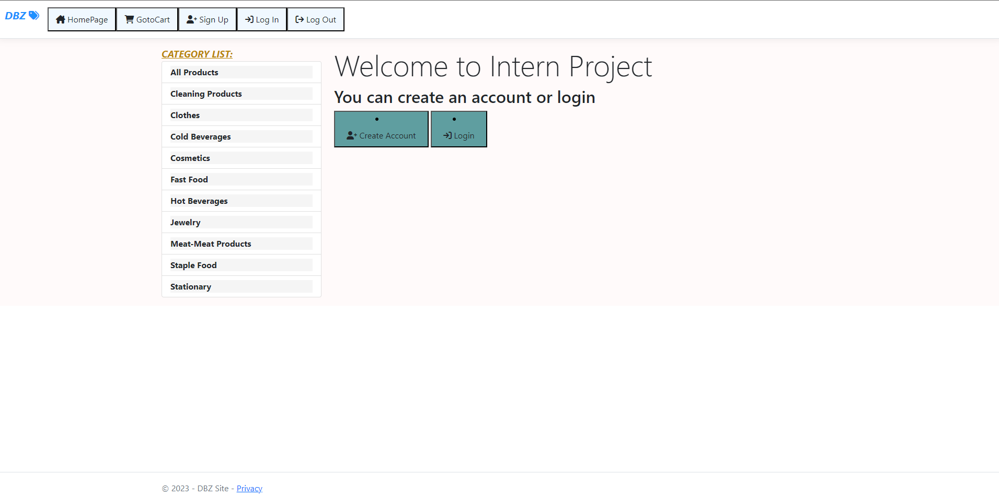
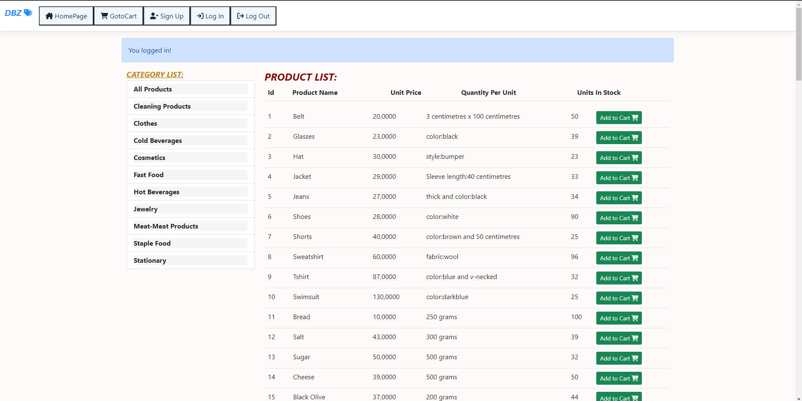
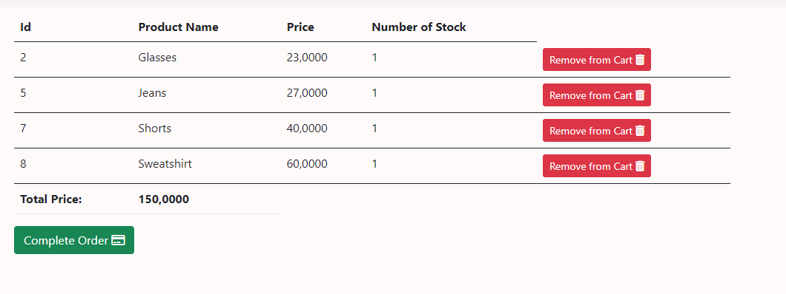

# .Net E-Commerce Site

- My aim in this project was to create an e-commerce site that is connected to the database I created, where user registration and login can be made, has a cart system and can perform basic functions. Since my main goal was to transfer my knowledge in the .Net field to the project, I did not spend much time on the front-end part.

# Home Page

When the project is run, the first thing you see is a page like this. This page cannot be exited without user login, that is, there is no access to any product. If there is a user registration, you can log in by going to the log in page, or if you are not registered, you can register by going to the sign up page. 

# Sign Up Page

If the information requested on this page is entered as desired and the information of the previously registered user is not entered, the registration can be created successfully. 

# Log In Page

 
If the user's e-mail and password are entered correctly on this page, the site will be successfully logged in and the user can access the products page. Otherwise, if the e-mail or password is incorrect, an error will be given and the login will not be accepted.

# Products Page 

The user can now view the products on this page, search for products by filtering them from the list of categories on the left, or add products to their cart. To go to the cart, you can reach it by clicking the Cart button on the top menu. They can also log out from the menu above.

# Cart Page

On this page, the user can see the products in their cart, delete and reduce the products, or complete their orders.

# Order complete

When you press the complete order button, all products in your cart are deleted.

- This project, which I developed by learning .net layers and database connections, was my first .net project. In the future, as I develop more comprehensive and advanced .net projects, I will add them to my github account :)

